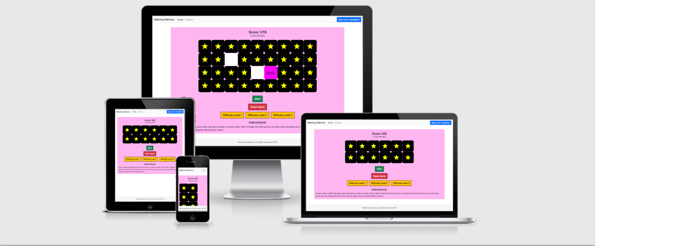
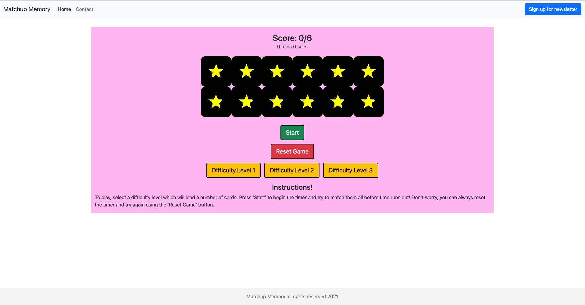
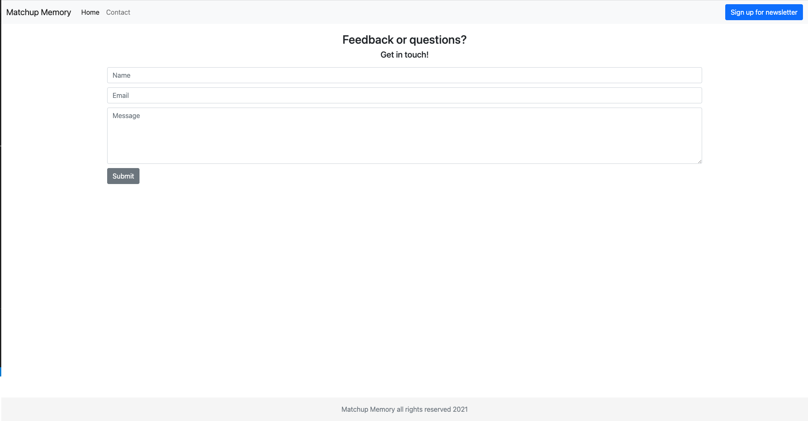
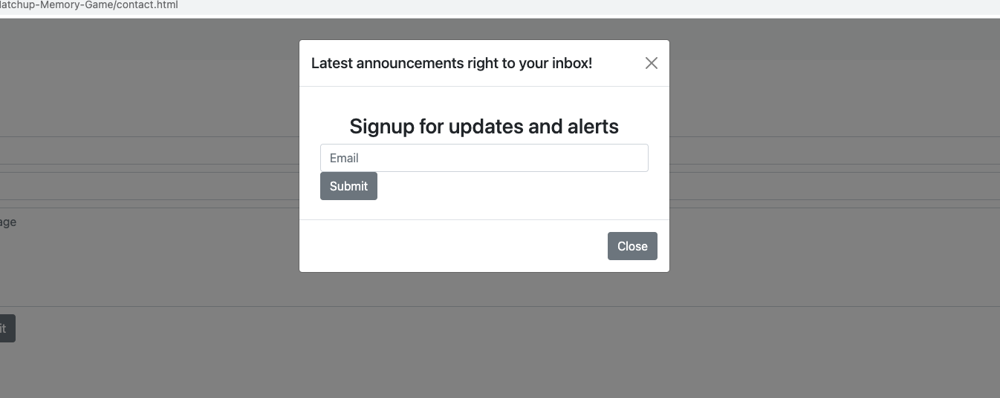

# Matchup Memory Game

## README

 

#### Project Goals/Target Audience

Memory Match is a fun, lighthearted and non intensive brain training game. Designed to be interactive and provide feedback to the user where necessary, its purpose is to provide entertainment and light exercise of short term memory. The application will be minimal in its processing needs and thereby be playable on a range of processors and devices of varying specification.
    
The applications main goals rest in providing entertainment whilst testing/improving a users short term memory. This will be achieved by providing a number of hidden items that the user can select and temporarily reveal. They will then have to match these with corresponding items elsewhere on the page. This is in the hopes that repeat games will improve the users ability to recall items quickly and correctly. 
     
Memory Match’s target audience is recommended at ages 5+, with no specific background, cultural distinction or qualifications being its intended user base. The basic nature of the game provides a high level of accessibility to an enormous range of adults and children, though there is a special consideration. Although not specifically designed for this purpose, Memory Match has the potential to provide important brain training for those suffering with any memory based or cognitive conditions. In unison with this is can also provide brain development assistance in children. 

 
 

 

## User Experience

### Player Goals

- Large clickable areas for children’s ease and mobility impaired
   
- Fun to play and engage with
 
- Satisfying to win
 
- Encouraging on loss
 
- Intuitive controls for children and less able 
 
- Intriguing imagery for all players
   
   

### Parent/Guardian Goals

- Content suitable to young children and those sensitive to it
   
- Encouraging and not frustrating
   
- Provide developmental value to short term memory 
   
- Enjoyable for child/individual 
   
- Deliver some educational content
 
 

### Developer Goals

- Simple to use
   
- Entertaining experience 
   
- Low stress usage
 
- Provide value to user
   
- Enhance user short term memory
 
- High compatibility for user ease of access 
   
   

### User Stories 

* First time User Goals

  - As a first time user, I want to easily ascertain the main purpose of the application and its value to me. 
   
  - As a first time user, I want to easily interact with the application and its controls, visibly receiving feedback. 
   
  - As a first time user, I wish to see exciting images and animations that draw me into the application further.
   
  - As a first time user, I want to be entertained whilst using the application.
   
   
* Returning User Goals
   
  - As a returning user I wish to beat my previous score/time.
   
  - As a returning user I wish to improve my short term memory performance. 
   
  - As a returning user I want to know if there are any more games I can access by the same developer.
   
   
* Frequent User Goals
   
  - As a frequent user, I want to be able to raise the difficulty to keep the game engaging.
   
  - As a frequent user, I want to provide feedback to the developer on improvements and potential new features.
   
   
 * User (child)
   
   - I wish the game to be aesthetically appealing and interesting, gaining my attention. 
   
   - Controls should be obvious and visibly displayed to me in some way.
   
   - I should be able to pick a difficulty.
   
   - Should be in some way new each time I play.
   
   
  * Developer Goals
   
  - As a developer, I want new users to discover the application.
   
  - As a developer, I want new users to engage with the application and enjoy it.
   
  - As a developer, I want users to return to improve their scores and times.
   
  - As a developer, I wish users to improve their short term memory performance.
   
  - As a developer, I want returning users to provide feedback on improvements/features they      
    wish to see.
   
  - As a developer, I want returning users to signup for announcements and future projects.
   
   

## Design 

### Design Choices

Beginning this stage by researching other available matching card games I began to make a list of desirable design aspects I wanted to be included. Top priorities were to make the design appealing to children and adults alike, to present an engaging colour scheme and objects to interact with. The use of shapes stood out as a fine way to draw the user in to select cards and see what’s hidden underneath. Alongside this the need to make the cards themselves visually appealing was evident in my own research, games I enjoyed most did this. 

Interactivity needed to be simple and precise, one should be able to understand the games and its controls instinctively. Simplicity was key here and thus clear, large buttons where used alongside clearly differentiated cards to select from. Basic instructions were also included but the design has been constructed as such that these shouldn’t always be necessary. 

To fulfil the educational aspect of the user requirements I opted to include numbers, colours and letters as the matching criteria for the game. These provide a low level challenge with some language/numeracy development for children and potentially for the impaired. Together with the training of memory these should serve to provide some revision for those in need of it, it’s also provides a nice variation.

Different difficulty levels allow the user to fine tune their experience and if so desired increase the challenge of the game to quite a high level. This variation makes the game more versatile for a large number of users and provides a reason to return. 

### Wireframes

The following wireframes were constructed within Balsamiq(link this) during the Scope Plane section of the design and planning stage for this project. They represent an early design concept that has largely been kept to through to final product. However do note that they vary slightly from the final design, this is due to practical considerations that arose during the surface plane stage. Some design aspects were altered due to time constraints and practical limitations however I feel the main aim of the project has been realised.

[Homepage Dektop](assets/readme/homepage_desktop.png)

[Homepage Tablet](assets/readme/homepage_tablet.png)

[Homepage Phone](assets/readme/homepage_mobile.png)

[Contact Dektop](assets/readme/contact_desktop.png)

[Contact Tablet](assets/readme/contact_tablet.png)

[Contact Phone](assets/readme/contact_mobile.png)

[Initial Sketch](assets/readme/initial_sketch.jpg)

### Colours 

Card colours used were carefully selected from a colour chart to include all major primary colours and then contrasting colours that suited visually. As seen colours assigned to cards with their names tally and there is continuation in the use of orange for numbers and aqua for letters. This is to prevent the visual aspect of the game becoming too busy or distracting. The colour continuity also provides an aid at the higher level difficulty with some visual memory assistance. 

The background colour of pale pink was chosen to contrast with images, icons and text as well as reduce eyestrain by being pale and not being an overtly bight colour on a screen. This colour isn’t used anywhere within the game itself. 

Menu buttons were assigned colours based on the generic understanding that green begins things and red stops, yellow for selecting. This is a simple and reused concept found in everyday life through various means. 

### Fonts

For this project fonts were left as default as they were quite adequate to portray information. The main focus is the imagery and this is where I wanted the used to be drawn, having clear and concise scoring/instructions was all that was necessary.

### Cards/Placeholders

The cards were designed using GIMP 2.10, a free design tool that allowed me to create pixel specific sized squares and colour/label as I pleased. This worked very well as it allowed me to make adjustments as I developed the project and try different styles easily. It was also possible to set the compression amount upon exporting the files, enabling them to be the right size for web use. 

### Styling

The general site layout is simple with little navigation needed. Placing the instructions at the bottom of the page enables mobile users to discover them is needed, however they can begin the instant the pages loads. This design enables access to the game with little fuss, no need to scroll the screen (apart from higher difficulty levels, screen size dependant). All of this comes together in allowing the game to present itself in a relaxed and smooth fashion which is ideal for parents and children trying to get to grips with what the site does. 

The contact form is clean and to the point, little styling makes it a simple affair to write the message required and submit. Likewise subscribing to the newsletter is swift and simple for the same reasons.

## Features

### Existing Features 

- feedback form
 
- Reset button
  
- Start Button 
 
- fully responsive
 
- Timer
 
- Game itself 
 
- Difficulty levels 
 
- feedback modal 
 
- colours, letters and numbers on cards for childrens reading 
 
 

### Navigation Bar

Nav bar provides links to both pages and works interchangeably on both.

### Homepage

Providing the game itself this landing page provides a background alongside card grid, game start and reset buttons as well as difficulty select.

### Contact

Enabling users to contact the developer directly this page provide an easy and simple way to write a message.

### Signup Modal

Enabling users to get all the latest updates and information straight to their inbox this is essential retaining longterm user interest.

### Footer

Simple footer providing a copyright statement for legal purposes.

* Additional Features 

  - Site is fully responsive

  - Contains interactive elements

  - Inter-page links for navigation

  - Timer
 
  -  Modal alerts during game

## Technologies Used

###Languages

- HTML
- CSS
- Javascript

## Frameworks, Libraries & Programs Used

- VS code 
  
    - Vs Code was used as the main editor for the project
   
- Bootstrap 5
  
    - Bootstrap was used to assist in the layout, styling and responsiveness of the site
   
- Git
  
    - Git was used for version control by utilising the Gitpod terminal to commit and push to Github
   
- Gitpod 
  
    - This was used a secondary editor when away from the main workstation
   
- GitHub
    - Used to store the projects code after being pushed from git
   
- Github desktop
  
    - Used to clone repositories from Github to local machine to work on
   
- Balsamiq
  
    - Used to create wireframes and plan design of site
   
- Google Fonts
  
    - Used to provide stylish and fitting fonts to the site
   
- jQuery
  
    - Provided with Bootstrap to enable certain responsive elements such as navbar 
   
- Jsdelivr
  
    - Provided with Bootstrap to enable certain responsive elements
   
- Popper.js
  
    - Provided with Bootstrap to enable certain responsive elements
   
- GIMP
  
    - Used to design and create img files specific to the project

## Testing

### Validator Testing

The entire site has been validated using the W3C Markup, W3C CSS and JShint validators. 

[Homepage HTML](assets/readme/homepage-val.png)

[Contact HTML](assets/readme/contact-val.png)

[Homepage js](assets/readme/homepagejs-val.png)

[Contact js](assets/readme/contactjs-val.png)

[CSS](assets/readme/css-val.png)

### Testing User Stories from User Experience (UX) Section 

## User Stories

### First Time User Goals (adult)

- As a first time user, I want to easily ascertain the main purpose of the application and its value to me.

- Upon entering the site, the user is presented with a clear grid and instructions from which to determine the use of the site and what it can do for them.

- As a first time user, I want to easily interact with the application and its controls, visibly receiving feedback.

- Each button provides feedback to the user and all tiles change appearance when clicked upon. Alert modals provide feedback when making a correct or incorrect match as well as time running out or completing the game.

- As a first time user, I wish to see exciting images and animations that draw me into the application further.

- The game has a vibrant colour scheme that reveals itself when clicking the black cards to reveal contrasting colours with lettering.

- As a first time user, I want to be entertained whilst using the application.

- The score display and countdown are design to give a small sense of urgency and challenge. This should keep the pace high and the fun continuous.
 
 

### Returning User Goals (adult)

  As a returning user I wish to beat my previous score/time.

- Easy reset of the game means a user can actively play again and again and beat their previous score or time.

- As a returning user I wish to improve my short term memory performance.

- A requirement of the game is the use of short term memory. Repeated use will inherently improve this and the varying difficulty only improve this further.

- As a returning user I want to know if there are any more games I can access by the same developer.

- A newsletter modal as well as feedback contact page allow users to contact the developer as well as getting updates to their inbox.
 
 

### Frequent User Goals (adult)

- As a frequent user, I want to be able to raise the difficulty to keep the game engaging.

- This is provided in the form of more cards to match in the same amount of time provide an adequate challenge.

- As a frequent user, I want to provide feedback to the developer on improvements and potential new features.

- Feedback can be provided through the contact page which allows questions and feedback.
 
 

### User (child)

- I wish the game to be aesthetically appealing and interesting, gaining my attention.

- Bright primary colours when cards flip provide excitement and interest as they reveal themselves against the black of the other cards. Matched cards disappear creating a sense that you wish to clear them all.

- Controls should be obvious and visibly displayed to me in some way.

- Simple start and reset buttons as well as simple controls to tap/click to match cards easy to follow. Game feedback modals also aid this.

- I should be able to pick a difficulty.

- This is provided through the three options available with the third proving quite a challenge.

- Should be in some way new each time I play.

- The cards are randomised each time a used plays and with the lowest number of cards being 12 this provides hundreds of variations up to thousands of assortments on the top level.
 
 

### Developer Goals

- As a developer, I want new users to engage with the application and enjoy it.

- The bug free application along with easy intuitive controls and difficulty levels is in good standing to provide entertainment and engagement to users.

- As a developer, I want users to return to improve their scores and times.

- The differing levels and score/time display within the game enhance the sense of competitiveness and this in turn can drive improvement.

- As a developer, I wish users to improve their short term memory performance.

- Repeated use of the game will inherently improve this without the users knowledge.

- As a developer, I want returning users to provide feedback on improvements/features they  
 wish to see.

- The clearly labelled contact page and signup modal both offer a way for the developer and user to interact with each other even if not directly. Signing up for the newsletter might lead to a contact submission if questions arise from an update.

- As a developer, I want returning users to signup for announcements and future projects.

- Signup modal is clearly displayed on each page and has a unique colour to draw the users to it.

## Further Testing

### Black Box

This testng relates to final stage testing where bugs have been removed. See design stage for bug reports and fixes. 

Test No | Test Feature | Expected Result | Actual | Pass/Fail
------------ | ------------- | ------------ | ------------ | -------------
1 | Launch Site | Site loads homepage | PASS | |
2 | Check Navbar styling | Navbar styled correctly  | PASS | 
3 | Homepage grid | cards in place | PASS | 
4 | Font, size and style | Styled correctly | PASS | 
5 | Start Button | Begins game operation/start timer | PASS | 
6 | Cards | flip when selected | PASS | 
7 | Cards | Match when correct, modal apears | PASS | 
8 | Cards | Don't match when wrong, modal appears | PASS | 
9 | Reset Button | Sets timer to zero and reloads grid | PASS | 
10 | Dif Level One | Selects Grid One | PASS | 
11 | Dif Level Two | Selects Grid Two | PASS | 
12 | Dif Level Two | Selects Grid Three | PASS |
13 | Contact Page | Loads correctly | PASS |
14 | Contact Page | Successful form submission | PASS |
15 | Contact Page | Successful modal submission | PASS |
16 | Homepage | Successful modal submission | PASS |
17 | Homepage | Game end when time reaches 4min | PASS |
18 | Hompage  | User wins when all cards matched | PASS |
19 | All site navbar links | All links function as expected | PASS | 
20 | Homepage | Modal lauches onto page | PASS | 
21 | Contact page | Modal lauches onto page | PASS | 

### Browsers
 - The site was tested on Google Chrome, Edge, Safari and Mozilla Firefox

### Lighthouse
 - Testing using lighthouse took place in chrome with these results

[Lighthouse Test](assets/readme/lighthouse.png)

### Devices
 - The site was tested on a variety of devices including a MacBook Pro, Dell Desktop, iPhone 11, iPad and Samsung Galaxy S20.
  
### Friends/Family Users
 - Family members and friends took part in testing using the site and informed of any bugs encountered

### Known Bugs

 - On some mobile devices grid can become off center depending on mobile screen size
   

## Deployment

### Github Pages

1. Log in to GitHub and locate the GitHub Repository
At the top of the Repository, locate the "Settings" Button on the option menu
 
2. Scroll down the Settings page until you locate the "GitHub Pages" Section
 
3. Under "Source", click the dropdown called "None" and select "Master Branch"
 
4. Press save.
    
5. Click the link now displayed.

### Forking the GitHub Repository 

Forking the Github repository makes a copy of the original repository on our GitHub account. We can then view and/or make changes without affecting the original repository.

1. Log in to GitHub and locate the GitHub Repository
 
2. At the top of the Repository locate the "Fork" Button
    
3. You should now have a copy of the original repository in your GitHub account

### Clone to desktop 

1. Donwload Github Desktop
    
2. Log in to GitHub and locate the GitHub Repository
    
3. Under the repository name, click "Clone to dektop".
    
4. Github dektop will ask you if you want to clone, click "Yes"
    
5. Click "Open in editor"
    
6. You have now cloned the project to your local machine

### Gitpod Clone

1. Download the gitpod chrome extension 
    
2. Locate the repository on Github 
    
3. On the righthand side of the menu bar choose "Gitpod"
    
4. Login to Gitpod using your Github account or make a new Gitpod account
    
5. You have now opened a new workspace within gitpod
    
6. The repository is clones to your Github 

ID | Filename.type | Description | Size | Location | Used
------------ | ------------- | ------------ | ------------ | ------------- | ------------
1 | index.html | Homepage | 10KB | Root | -
2 | contact.html | Contact Page | 12KB | Root | -
3 | 1_card.png | logo | 4KB | images | Homepage
4 | 2_card.png | logo | 4KB | images | Homepage
5 | 3_card.png | logo | 4KB | images | Homepage
6 | 4_card.png | logo | 4KB | images | Homepage
7 | 5_card.png | logo | 4KB | images | Homepage
8 | 6_card.png | logo | 4KB | images | Homepage
9 | a_card.png | logo | 4KB | images | Homepage
10 | b_card.png | logo | 4KB | images | Homepage
11 | c_card.png | logo | 4KB | images | Homepage
12 | d_card.png | logo | 4KB | images | Homepage
13 | e_card.png | logo | 4KB | images | Homepage
14 | f_card.png | logo | 4KB | images | Homepage
15 | pink_card.png | logo | 4KB | images | Homepage
16 | purple_card.png | logo | 4KB | images | Homepage
17 | red_card.png | logo | 4KB | images | Homepage
18 | green_card.png | logo | 4KB | images | Homepage
19 | yellow_card.png | logo | 4KB | images | Homepage
20 | blue_card.png | logo | 4KB | images | Homepage
21 | star_card.png | logo | 4KB | images | Homepage
22 | blank_card.png | logo | 4KB | images | Homepage

## Credits

### Code

[Bootstrap5 Used throughout](https://getbootstrap.com/)

[Alt text for background images](https://www.davidmacd.com/blog/alternate-text-for-css-background-images.html)

[Img Center](https://stackoverflow.com/questions/10879955/how-to-align-an-image-dead-center-with-bootstrap)

[Correct form input fields](https://stackoverflow.com/questions/7497765/html5-valid-form-input-fields)

[meta-data descriptions](https://yoast.com/meta-descriptions/)

[jQuery each function information](https://www.sitepoint.com/jquery-each-function-examples/)

[jQuery attr function](https://www.w3schools.com/jquery/html_attr.asp)

[jQuery information for various aspects of the library](api.jquery.com)

[Remove event listeners](https://www.youtube.com/watch?v=hO2b1hU9cfg)

[.find](https://api.jquery.com/find/)

[javascript timer](https://scotch.io/tutorials/how-to-build-a-memory-matching-game-in-javascript#toc-5-the-timer)

[inspitation for check card function, heavily modified](https://youtube.com/watch?v=tjyDOHzKN0=tjyw)

[emailJS](https://dashboard.emailjs.com)

[Guidance on use of fonts and simplistic design](https://www.30degreesnorth.com/blog/5-website-font-mistakes-you-dont-want-to-make)

### Content 
No external content used
### Media
No external media used
## Ackhnowledgements
 - Patrick Justus 
 - Harlow College 
 - Code Institute 
